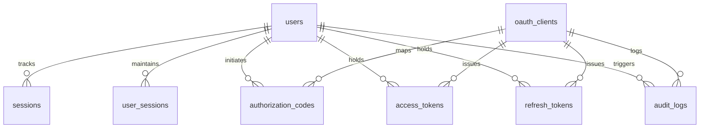
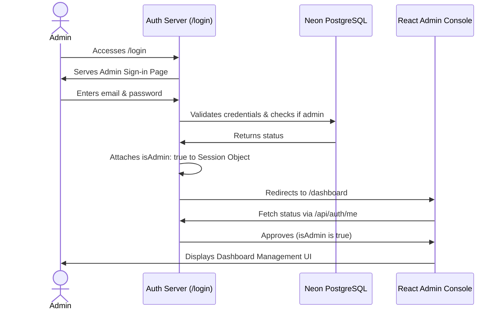
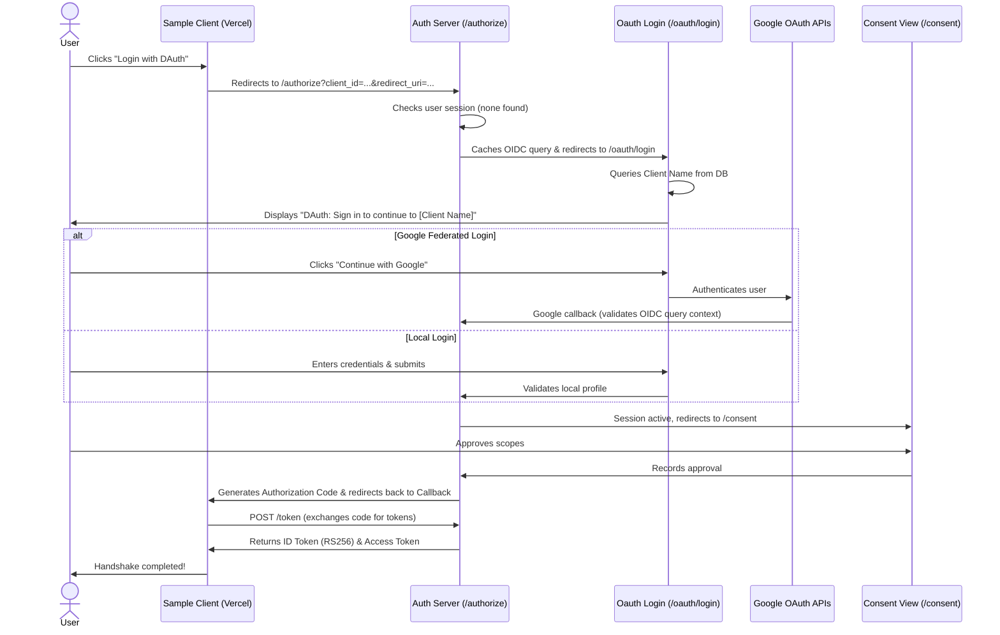

# DAuth Project Context Document

This document provides a complete, self-contained overview of the **DAuth (Identity Federation & OIDC Auth Server)** project. It details the architecture, codebase, database schema, authentication flows, recent updates, and deployment configurations.

You can copy and paste this document directly into a new ChatGPT or AI assistant conversation to instantly onboard the model onto the DAuth repository.

---

## 1. Project Overview

### What is DAuth?
**DAuth** is a self-hosted OpenID Connect (OIDC) Identity Provider (IdP) built from scratch. It is designed to emulate modern customer identity and access management (CIAM) systems like Auth0, Clerk, or Keycloak, but is structured to keep the architecture modular, highly secure, and readable.

### Why it was built & Problem Statement
In modern microservices or multi-tenant ecosystems, managing independent user credentials across multiple client applications introduces massive security vulnerabilities and a poor user experience. DAuth solves this by acting as a **Single Sign-On (SSO) central authority** utilizing industry-standard protocols (OAuth 2.0, OIDC, PKCE) and federating logins (Google Identity Federation) to consolidate identity management.

### Architecture & Layering Design
DAuth enforces a modular **Clean Architecture** layout. Each package and application is independent, and the backend utilizes a strict, single-directional data flow pattern:
```
Routes  ──>  Controllers  ──>  Services  ──>  Repositories  ──>  Database (Prisma)
```
* **Routes**: Handle request entry points and parse query/body inputs.
* **Controllers**: Coordinate data mapping, validate schemas, and formulate HTTP responses.
* **Services**: House pure business logic (cryptographic handshakes, password validations).
* **Repositories**: Abstract SQL queries and interface with Prisma ORM.

### Design Philosophy
1. **No Placeholders**: Every feature, route, and mock is fully operational; no empty helper stubs are utilized.
2. **Modular Independence**: Applications (Dashboard, Auth Server, Sample Client) and packages (UI, Shared) reside in a monorepo but do not leak implementation dependencies.
3. **Security-First**: Enforces HTTPS, secure HTTP-only session cookies, bcrypt password hashing, CSRF protection, and RS256 asymmetric cryptographic JWT token signing.

---

## 2. Technology Stack

* **Language**: JavaScript (ES Modules, `type: module`). *TypeScript is intentionally excluded.*
* **Frontend**: React, Vite, Tailwind CSS, React Router, React Hook Form.
* **Backend**: Node.js, Express.js.
* **Database**: PostgreSQL (hosted on Neon Serverless Postgres).
* **ORM**: Prisma ORM.
* **Authentication/Security**:
  * **Session Management**: `express-session` with a PostgreSQL session store (`@quixo3/prisma-session-store`).
  * **Cookie Management**: `cookie-parser`.
  * **Asymmetric Token Signing**: `jose` (RS256 JWT keypairs).
  * **Encryption**: `bcrypt` (12 salt rounds).
  * **CSRF Mitigation**: Custom CSRF validation.
* **Federated Logins**: Google Identity Federation via Google OAuth 2.0 API.
* **Deployment**:
  * **Backend API & Admin Dashboard**: Render (`dauth-darshan.onrender.com`).
  * **Sample Client**: Vercel (`sample-client-five.vercel.app`).
* **Package Management**: npm Workspaces (monorepo).

---

## 3. Project Structure

DAuth is managed as an npm monorepo with the following project directories:

```
DAuth/
├── apps/
│   ├── auth-server/      # Core OIDC Identity Provider (Express API)
│   ├── dashboard/        # React Admin Dashboard (Console Client)
│   └── sample-client/    # React OIDC Sample Client Application
├── packages/
│   ├── ui/               # Shared Design System & Component Library
│   └── shared/           # Shared constants, helpers, and utilities
├── package.json          # Monorepo workspaces definition
└── PROJECT_CONTEXT.md    # Onboarding documentation
```

### Workspace Responsibilities:
1. **`apps/auth-server`**: Serves OIDC discovery configs, JWKS, token exchanges, authorization codes, session tracking, Google login callbacks, user registration, and console management endpoints.
2. **`apps/dashboard`**: Dedicated interface for administrators (`admin@dauth.io`) to view system status, audit logs, and manage registered OAuth clients (add, edit, delete client details).
3. **`apps/sample-client`**: A demo integration sandbox showing how standard client web applications redirect unauthenticated users to DAuth to perform OIDC log-ins.
4. **`packages/ui`**: Holds components (buttons, cards, loaders) shared between frontend interfaces to maintain styling uniformity.

---

## 4. Current Features

### Completed Features (Fully Functional):
* **Local Authentication**: Full Email + Password registration and sign-in.
* **Admin Console**: Strict UI layout for managing client profiles and reading audit logs.
* **OAuth Client Management**: Creation, modification, and deletion of OIDC client registries (`client_id`, `client_secret`, allowed scopes, allowed redirect URIs).
* **Authorization Code Flow with PKCE**: Cryptographic validation of auth codes and verifiers utilizing SHA-256 challenges (`S256`).
* **Consent Screen**: Intermediate scope validation page requesting user consent before authorizing clients.
* **Discovery Endpoint**: `.well-known/openid-configuration` listing all OIDC endpoints.
* **JWKS Endpoint**: JSON Web Key Set (`/jwks`) distributing public keys to verify RS256 JWTs.
* **RS256 Signing**: Tokens are signed using asymmetric private keys.
* **UserInfo Endpoint**: Serves user metadata (`/userinfo`) using Bearer access tokens.
* **Session Management**: Persistent cookies tracking administrator consoles and user SSO states.
* **CORS Self-Healing**: Automated sanitization of raw configuration strings (removes line endings, whitespaces, and prefixes).
* **Dynamic CORS Preview Matches**: Dynamic pattern recognition permitting Vercel preview environments (e.g. `https://sample-client-*.vercel.app`) to query endpoints.
* **Double-Mount Callback Mitigation**: Client-side logic in `Callback.jsx` avoiding duplicate state verifications and mitigating race conditions during React 18 mounts.

### Partially Completed / Configured Features:
* **Google Identity Federation**: Configured for OIDC client authentication, linking Google social accounts with existing email profiles (or creating new federated users). *Microsoft and GitHub login keys are stubbed/registered in config but not yet active in controllers.*

---

## 5. OpenID Connect Implementation Details

### A. Discovery Endpoint (`/.well-known/openid-configuration`)
Exposes all metadata for client auto-discovery:
* `issuer`: `https://dauth-darshan.onrender.com`
* `authorization_endpoint`: `/authorize`
* `token_endpoint`: `/token`
* `jwks_uri`: `/jwks`
* `userinfo_endpoint`: `/userinfo`
* Supports: `code` response type, `authorization_code` grant, `S256` PKCE, and scopes: `openid`, `profile`, `email`.

### B. Authorization Endpoint (`/authorize`)
Handles OIDC requests:
1. Validates `client_id`, `redirect_uri`, `scope`, and `response_type`.
2. Checks if an active user session exists in `req.session.user`.
   * **If unauthenticated**: Caches parameters to `req.session.authRequest` and redirects to `/oauth/login`.
   * **If authenticated**: Redirects to the consent approval screen (`/consent`).

### C. Token Endpoint (`/token`)
Processes code-to-token swaps:
1. Validates PKCE challenge: hashes incoming `code_verifier` (SHA-256) and asserts it matches the cached `code_challenge`.
2. Generates an asymmetric signed **ID Token** containing user claims (`sub`, `email`, `name`).
3. Issues a random opaque **Access Token** and caches a database profile in `AccessToken`.
4. Returns payload with token expiration lifespans.

### D. JWKS URI (`/jwks`)
Distributes public key components (`kty: RSA`, `use: sig`, `alg: RS256`, modulus `n`, exponent `e`) generated dynamically or read from disk.

### E. UserInfo Endpoint (`/userinfo`)
Authenticates request header Bearer tokens:
```
Authorization: Bearer <access_token>
```
Validates the token in database, checking expiration, and returns JSON claims: `{ sub, email, name }`.

---

## 6. Database Configuration & Schema

DAuth maps database entities via Prisma ORM using the following relational models:



### Table Definitions & Primary Columns:
1. **`User` (`users`)**: Represents authenticated accounts. Stores `email`, `passwordHash`, `name`, and profile timestamps.
2. **`OAuthClient` (`oauth_clients`)**: Registered OIDC client profiles. Stores `clientSecret` (bcrypt hash), `redirectUris` (string array), and `allowedScopes` (string array).
3. **`AuthorizationCode` (`authorization_codes`)**: Temporary codes issued during the authorize flow. Stores PKCE `codeChallenge`, `codeChallengeMethod`, and validation expiration.
4. **`Session` (`sessions`)** & **`ExpressSession` (`express_sessions`)**: Handle persistent user state storage and link browser cookies to node session maps.
5. **`AccessToken` (`access_tokens`)** & **`RefreshToken` (`refresh_tokens`)**: Manage issued security credentials, tracking active token strings and revocation flags.
6. **`AuditLog` (`audit_logs`)**: Centralized system event ledger tracking actions (`USER_LOGIN`, `CLIENT_CREATED`, `TOKEN_ISSUED`), target IDs, IP addresses, and metadata payloads.

---

## 7. Authentication Flows

DAuth splits administrative entry and user-facing authentication into two entirely isolated systems.

### A. Admin Console Login Flow (`/login`)
Only permitted for local Email + Password login. No social buttons or registrations exist.


### B. End-user OIDC Authorization Flow (`/authorize` -> `/oauth/login`)
Triggered when external client applications request authentication. Supports email/password or Google sign-in.


---

## 8. Current Project Status

### What is fully complete:
* Fully decoupled login pages: Admin interface (`/login`) and OIDC login interface (`/oauth/login`).
* Dynamic client lookup displaying the requesting application's name on OIDC login.
* Dynamic CORS parsing allowing automatic verification of preview deployment urls.
* Token exchange logic with active PKCE cryptographic verification.
* Session models persisted securely in Neon PostgreSQL.

### What is intentionally excluded:
* Public registration links from the Admin console (to prevent unauthorized dashboard registrations).
* Social credentials for administrator sessions (only email + password permitted to enter the console).

### Known limitations:
* Access to Vercel preview environments requires CORS checks, which are handled dynamically via matches on the backend, but if a preview URL uses a customized subdomain (not matching `sample-client-*.vercel.app`), it must be registered manually in the database.

---

## 9. Recent Changes (Latest Architectural Decisions)

1. **Decoupled Sign-In UI**:
   * Previously, administrators and OIDC clients logged in on the same page. Now, `/login` is exclusively for administrators (styled with DAuth Console branding, warning notices, and no social login button), and `/oauth/login` is for OIDC users (styled dynamically with client app labels).
2. **Registration Target Decoupling**:
   * Modified `register.js` redirects. If a user completes signup during an OIDC flow, they are routed back to the client-facing `/oauth/login` template. If they register outside a flow, they route to the main `/login` console.
3. **CORS Safeguard Matches**:
   * Programmed a custom wildcard CORS match in `app.js` checking if incoming `Origin` headers start with `https://sample-client-` and end with `.vercel.app` to resolve Vercel deployment blockers.
4. **React Double-Mount Resolution**:
   * Patched `Callback.jsx` in the React sample client. Added a check `if (localStorage.getItem('dauth_session'))` to bypass token validation if a session is already present, avoiding state mismatch issues triggered by double-execution.

---

## 10. Deployment Configuration

* **Backend & Admin Dashboard Hosting**: Hosted on **Render** under a monorepo setup. The build process runs a command which installs project modules, builds the frontend code, generates the Prisma schema client, and runs Node:
  ```bash
  npm install --include=dev && npx prisma generate --schema=apps/auth-server/prisma/schema.prisma && npm run build
  ```
* **Sample Client Hosting**: Hosted on **Vercel** with direct links to the Render backend for authorization and callback endpoints.
* **Database**: Serverless PostgreSQL hosted on **Neon**.
* **Environment Variables**:
  * `DATABASE_URL`: Prisma connection string to Neon.
  * `ALLOWED_ORIGINS`: Comma-separated CORS allowed domains.
  * `DASHBOARD_URL`: Address of the admin frontend.
  * `GOOGLE_CLIENT_ID` & `GOOGLE_CLIENT_SECRET`: App credentials for Google Identity Federation.
  * `SESSION_SECRET`: Session signature string.

---

## 11. Files & Important Components

* **[`apps/auth-server/src/app.js`](file:///e:/DAuth%20-%20My%20OIDC%20Server/apps/auth-server/src/app.js)**: Configures rate limiters, Helmet security policies, session stores, and CORS settings.
* **[`apps/auth-server/src/routes/login.js`](file:///e:/DAuth%20-%20My%20OIDC%20Server/apps/auth-server/src/routes/login.js)**: Configures the Admin console login page, login routes, and tracks the `isAdmin` session flag.
* **[`apps/auth-server/src/routes/oauthLogin.js`](file:///e:/DAuth%20-%20My%20OIDC%20Server/apps/auth-server/src/routes/oauthLogin.js)**: New OIDC-specific route serving the client authorization login portal and querying the database for requesting client profiles.
* **[`apps/auth-server/src/routes/register.js`](file:///e:/DAuth%20-%20My%20OIDC%20Server/apps/auth-server/src/routes/register.js)**: Handles registration, dynamically routing user redirects based on active OIDC contexts.
* **[`apps/auth-server/src/controllers/oidc.js`](file:///e:/DAuth%20-%20My%20OIDC%20Server/apps/auth-server/src/controllers/oidc.js)**: The heart of OIDC authorization logic, orchestrating codes, consent redirections, and token generation.
* **[`apps/sample-client/src/components/Callback.jsx`](file:///e:/DAuth%20-%20My%20OIDC%20Server/apps/sample-client/src/components/Callback.jsx)**: Completes the OIDC handshake and includes race-condition guards.

---

## 12. Known Issues & Pending Tasks

* **Google Login Redirects**: Direct social callbacks targeting the console must have an active `authRequest` to ensure social accounts cannot log into the Admin Console without administrator clearance.
* **Database Cleanup Tasks**: Need a cron job or worker service to periodically prune expired `AuthorizationCode`, `AccessToken`, and `RefreshToken` records.

---

## 13. Future Roadmap

1. **Federation Expansion**: Enable the configuration stubs for GitHub and Microsoft log-ins.
2. **Session Revocation Panel**: Add an interface in the Admin Dashboard to let administrators revoke user sessions globally.
3. **Multi-Client Registration Panel**: Build UI forms in the Admin Console to allow administrators to add multiple custom redirect URIs directly instead of manual database edits.

---

## 14. Technical Interview Summary

### Problem DAuth Solves
Centralizes identity management, SSO, and federated log-ins securely in a self-hosted environment, eliminating credential fragmentation across microservices while matching modern identity platform standards.

### System Architecture
Monorepo using Node.js/Express for backend APIs, React/Vite for frontend consoles, PostgreSQL for persistence, and Prisma ORM. Follows clean-architecture layers: Routes, Controllers, Services, Repositories.

### Flow Execution (SSO)
Client applications redirect unauthenticated users to `/authorize`. The server checks SSO state, directs users to `/oauth/login`, prompts for consent, and returns an authorization code via PKCE challenge. The client exchanges this code for access and ID tokens signed using RS256.

### Core Security Controls
* Secure HTTP-only cookies.
* Cryptographic PKCE code challenge matches (SHA-256).
* Asymmetric token signing via Jose (RS256).
* CORS protection allowing only registered and recognized Vercel subdomains.
* React double-mount validation bypasses.

---

## 15. Context for New ChatGPT Conversation

*Copy and paste the text block below to initialize a new conversation.*

```
Onboard onto the DAuth project. DAuth is a self-hosted OpenID Connect (OIDC) Identity Provider built using Node.js, Express, PostgreSQL, Prisma ORM, and React (Vite/Tailwind). It operates inside a monorepo setup utilizing npm Workspaces.

Key Architecture to Keep in Mind:
1. Backend Routing Isolation:
   - `/login` (login.js) is ONLY for DAuth Administrators (Email + Password only, no social login). Success gives session.user.isAdmin = true.
   - `/oauth/login` (oauthLogin.js) is for end-user OIDC client log-ins. It supports Google federation and displays the requesting client name dynamically using ClientRepository.
   - `/authorize` (oidc.js) is the entry point for standard OIDC code flows. Unauthenticated requests cache OIDC params to req.session.authRequest and route to /oauth/login.
   - `/register` (register.js) is for user registration, routing success back to /oauth/login (if OIDC) or /login (if direct admin creation).

2. Security Details:
   - Access tokens and ID tokens are signed using RS256 private keypairs.
   - Admin routes (requireAuth middleware) and frontend guards (AuthContext.jsx) verify session.user.isAdmin === true.
   - CORS settings in app.js allow only registered domains and dynamically match Vercel preview environments: https://sample-client-*.vercel.app.
   - Callback.jsx handles React 18 double-mount race conditions by checking for cached dauth_session in localStorage before executing token handshakes.

3. Database Details:
   - Managed via Prisma schema. Main tables: User, OAuthClient, AuthorizationCode, Session, UserSession, AccessToken, RefreshToken, AuditLog, ExpressSession.

Use this context to handle coding tasks, debug routing issues, or expand authentication flows. All code generated must be in ES Modules JavaScript (no TypeScript). Maintain strict modular design.
```
