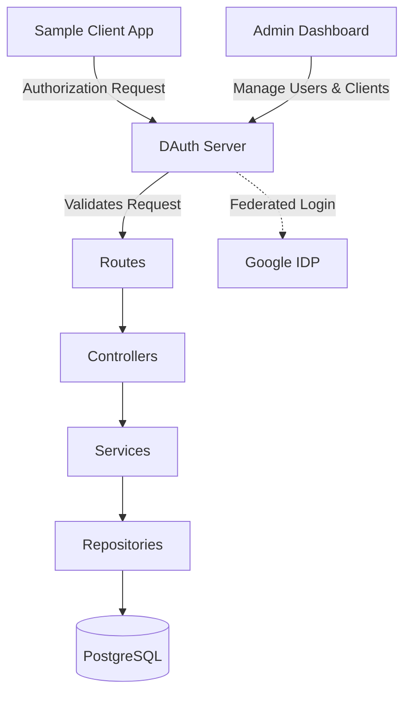
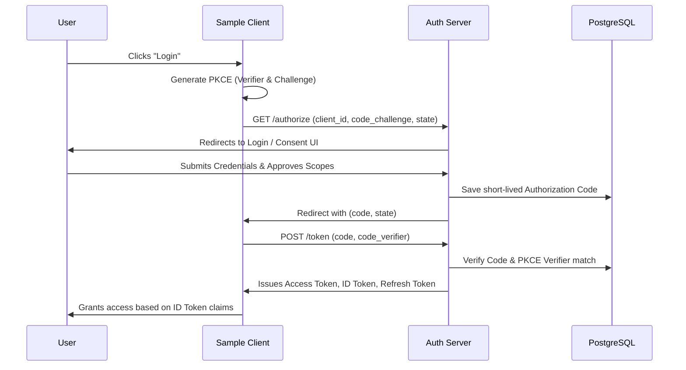

# 🔐 DAuth - OpenID Connect Identity Provider

[](https://opensource.org/licenses/MIT)
[](https://github.com/dauth/dauth-monorepo/actions)

**DAuth** is a self-hosted, production-ready **OpenID Connect (OIDC) Identity Provider** built from the ground up. It implements standard authentication and authorization protocol specifications with a highly legible, modular architecture. 

Rather than relying on heavy third-party SaaS admin dashboards (like Auth0 or Clerk), DAuth serves as a clean, reference blueprint for developers wanting to master OAuth 2.0, OpenID Connect 1.0, PKCE validation, and cryptographic token management.

---

## ✨ Key Features

- **Authorization Code Flow:** Strict redirect-based authentication flow.
- **Proof Key for Code Exchange (PKCE):** Secure PKCE flow utilizing SHA-256 verifiers (`S256`).
- **Cryptographic Token Rotation & Signatures:** ID Tokens signed via `RS256` asymmetric keys.
- **Discovery Endpoint:** Compliant standard `GET /.well-known/openid-configuration`.
- **JWKS Endpoint:** Serves JSON Web Key Set (`GET /jwks`) mapping to active keys.
- **Replay Attack Protections:** Revokes all active refresh tokens for the user/client pair if an authorization code is re-submitted.
- **Double-Submit CSRF Cookies:** Custom state-changing request checks.
- **Google Identity Federation:** Supports OIDC account linking directly with Google out of the box.

---

## 🏗 System Architecture

DAuth separates HTTP layers from database interactions and business logic:



### 🗂 Folder Structure

```
dauth-monorepo/
├── apps/
│   ├── auth-server/         # Node.js/Express.js Backend API
│   ├── dashboard/           # React + Vite Admin Console
│   └── sample-client/       # React + Vite Relying Party Client
├── packages/
│   ├── ui/                  # Shared React UI components
│   └── shared/              # Shared helper functions
├── docs/                    # Architectural and API documentation
└── .env.example             # Environment templates
```

---

## 🔒 OpenID Connect & PKCE Flow

DAuth strictly follows the OAuth 2.0 and OpenID Connect specifications to secure single-page applications:



### What is PKCE?
**PKCE** (Proof Key for Code Exchange) is an extension to the Authorization Code flow that prevents malicious applications from intercepting an authorization code and exchanging it for tokens. It achieves this by forcing the client to dynamically generate a cryptographic secret (`code_verifier`) and pass a hash of it (`code_challenge`) during the initial authorization step.

---

## 🖼 Screenshots
*(Placeholders - Add screenshots of the Login, Consent, and Dashboard panels here)*


---

## 🚀 Installation & Setup

### Prerequisites
- Node.js 18+
- PostgreSQL database instance

### 1. Clone & Install
```bash
git clone https://github.com/yourusername/dauth.git
cd dauth
npm install
```

### 2. Environment Setup
```bash
cp .env.example .env
```
Ensure your `.env` file contains your local `DATABASE_URL` and `SESSION_SECRET`. No API keys or secrets should ever be committed to version control.

### 3. Database Setup (Prisma)
Sync your PostgreSQL database schema with Prisma and seed the default administrator user:
```bash
npx prisma db push --schema=apps/auth-server/prisma/schema.prisma
npx prisma db seed --schema=apps/auth-server/prisma/schema.prisma
```

### 4. Running the Project
Start the development servers for all three workspace directories concurrently:
```bash
npm run dev
```

- **Auth Server:** `http://localhost:3001`
- **Dashboard Console:** `http://localhost:5173`
- **Sample Client:** `http://localhost:5174`

---

## 📡 API Endpoints

### OpenID Connect Endpoints
- `GET /.well-known/openid-configuration` - Discovery document metadata.
- `GET /authorize` - Interactive authorization flow.
- `POST /token` - Swaps authorization codes or refresh tokens for tokens.
- `GET /jwks` - Returns public keys for signature verification.
- `GET/POST /userinfo` - Returns profile claims for authorized tokens.

*For detailed endpoints and request formatting, please refer to the `docs/api-reference.md`.*

---

## ☁️ Deployment Instructions

1. **Database:** Deploy PostgreSQL via Neon, AWS RDS, or Supabase.
2. **Backend:** Deploy the `auth-server` application to a Node.js runtime (Render, Heroku, or AWS EC2). Ensure `NODE_ENV=production` is set to enforce secure cookies.
3. **Frontend:** Run `npm run build` at the monorepo root. Deploy the resulting `dist/` folders for the `dashboard` and `sample-client` to a static hosting provider (Vercel, Netlify, AWS S3).
4. **Environment Variables:** Update `ALLOWED_ORIGINS` and `ISSUER` in production to match your live domains.

---

## 🔮 Future Improvements
- **Dynamic Client Registration:** Support for RFC 7591 dynamic endpoints.
- **Dynamic PKCE enforcement:** Selectively enforce PKCE checks per client type.
- **Client Credentials Grant:** Support machine-to-machine server integrations.

---

## 📜 License
This project is licensed under the MIT License - see the [LICENSE](LICENSE) file for details.
