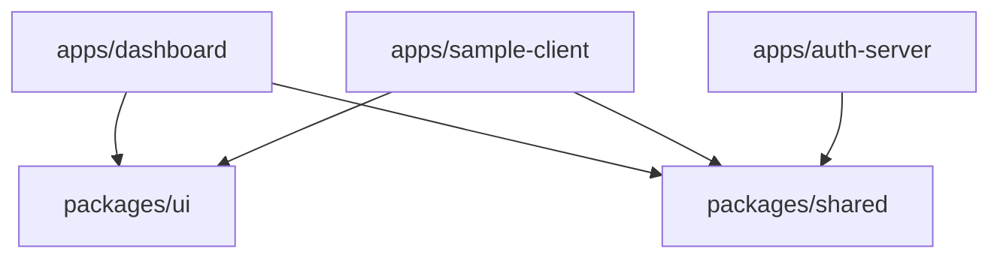

# System Architecture

DAuth is built as a private monorepo workspace containing three applications and two shared packages. This structure promotes clear boundaries, dependency isolation, and simple local execution.

---

## 📂 Project Structure

```
dauth/
├── apps/
│   ├── auth-server/      # Express backend (OIDC Server / Identity Provider)
│   ├── dashboard/        # React + Vite admin console (Client config registry)
│   └── sample-client/    # React + Vite sample app (handshake test landing)
├── packages/
│   ├── shared/           # Shared JS utility code (email/pwd validation, constants)
│   └── ui/               # Shared Tailwind CSS design system library components
├── docs/                 # Product documentation specifications
├── package.json          # Monorepo workspaces definitions
└── gemini.md             # Coding style and architecture instructions
```

---

## 🔗 Workspace Dependencies

The dependencies and bindings across the monorepo workspaces are structured as follows:



---

## 🏛️ Backend Architecture Layering

The `auth-server` backend conforms to a clean, decoupled MVC model:

```
[HTTP Request]
     │
     ▼
 1. Routes (Endpoints Mapping)
     │
     ▼
 2. Validators (Parameter Schema Assertions)
     │
     ▼
 3. Controllers (Requests Parsing & Serialization)
     │
     ▼
 4. Services (Business Logic & Credentials Operations)
     │
     ▼
 5. Repositories (Database Access Abstraction Layer)
     │
     ▼
 6. Database (Prisma Client / PostgreSQL)
```

1. **Routes Layer**: Exposes endpoints and registers validators, protection middlewares, and controllers. No business logic resides here.
2. **Validators Layer**: Sanitizes request bodies and queries (validating emails, redirects, OIDC parameters) before execution reaches controllers.
3. **Controllers Layer**: Isolates raw HTTP parameters, invokes services, sets cookie/headers states, and returns structured JSON responses.
4. **Services Layer**: Orchestrates business workflows, coordinates password hashing/verifications, JWT token signing, and records creation.
5. **Repositories Layer**: Encapsulates DB CRUD transactions. No queries exist outside repository files.
