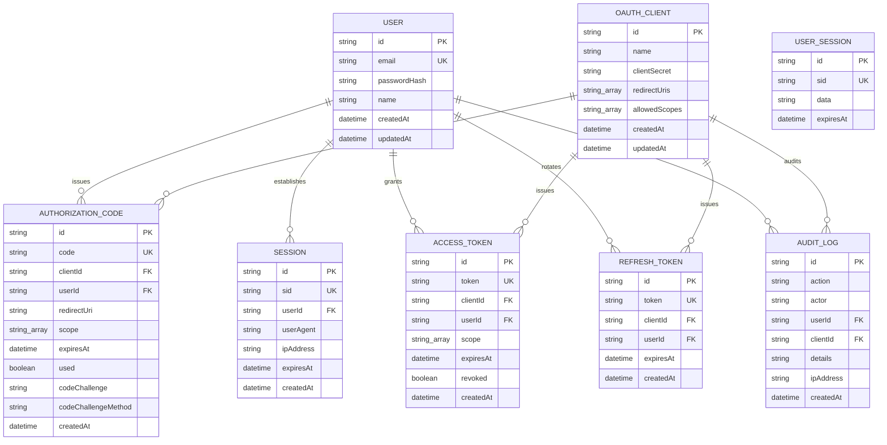

# Database Design & Schema

DAuth uses **PostgreSQL** as the primary storage engine, with **Prisma ORM** managing migrations and database transactions.

---

## 🗺️ Entity Relationship (ER) Diagram

---

## 🗄️ Model Mappings & Schema Specifications

### 1. `User`

Stores credentials for OIDC end-users and dashboard administrators.

- `email`: Normalized to lowercase; unique identifier constraint.
- `passwordHash`: Stored as a secure 12-round `bcrypt` signature.

### 2. `OAuthClient`

Stores registered OIDC Relying Client configurations.

- `clientSecret`: Stored as a secure `bcrypt` hash. Plaintext values are only shown once during creation/rotation.
- `redirectUris`: Array of validated callback URLs.
- `allowedScopes`: Array of permitted scopes (`openid`, `profile`, `email`, `offline_access`).

### 3. `AuthorizationCode`

Stores temporary authorization codes issued during code grants.

- `code`: Unique identifier, expires in 10 minutes.
- `used`: Single-use boolean flag to prevent replay attacks.
- `codeChallenge`/`codeChallengeMethod`: PKCE parameters.

### 4. `Session`

Stores active OIDC Single Sign-On (SSO) browser sessions linked by cookie identifier (`sid`).

### 5. `UserSession`

Internal session table backing `express-session` storage for the admin dashboard console.

### 6. `AccessToken` & `RefreshToken`

Tracks active token grants and revocation states for connected clients.

### 7. `AuditLog`

Audit trails recording key events (login, client creation, key rotations). Uses `onDelete: SetNull` on links so security logs remain intact even if user or client accounts are deleted.
