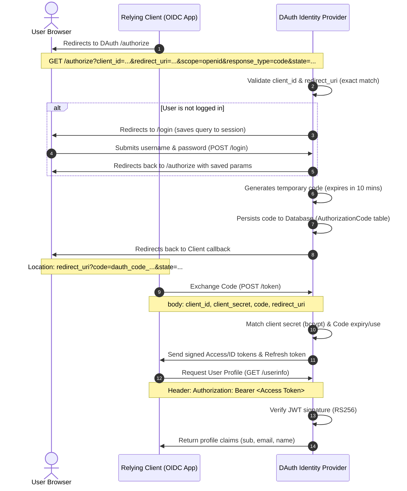

# OIDC Authorization Code Flow

DAuth implements the OpenID Connect (OIDC) Authorization Code Flow to securely authenticate user identities and delegate authorization to Relying Client applications.

---

## 🔄 Interaction Sequence

Below is the complete message handshake sequence between the browser, Relying Client, and DAuth:

---

## 🛠️ Step-by-Step Flow Details

### 1. Authorization Endpoint (`GET /authorize`)

- The client redirects the user's browser to DAuth with registration parameters.
- DAuth validates the client profile and checks that the callback exactly matches registered URLs.
- If not logged in, the user signs in via `/login`.
- DAuth issues a cryptographically secure random single-use code (`dauth_code_<32-hex-chars>`) with a 10-minute lifetime.
- Redirects the browser to `redirect_uri?code=dauth_code_...&state=...`.

### 2. Token Endpoint (`POST /token`)

- The client exchanges the authorization code for tokens by providing its credentials (secret) and redirect URI.
- DAuth verifies the client's secret hash via `bcrypt` and checks the code's status.
- Once verified, the code is marked as `used` immediately.
- DAuth issues:
  - **Access Token**: Signed RS256 JWT mapping permissions and scopes.
  - **ID Token**: Signed RS256 JWT detailing user identity claims.
  - **Refresh Token**: Opaque string to request subsequent access keys.

### 3. UserInfo Endpoint (`GET /userinfo`)

- The client requests user profile claims by providing the Access Token in the `Authorization: Bearer <Access Token>` header.
- DAuth verifies the signature using the public key and returns user profile claims based on scopes (`sub`, `email`, `name`).

---

## 🔐 Token Cryptography (RS256)

DAuth generates 2048-bit RSA keys in memory on startup. Token signatures are generated using the private key using **RS256** and verified using the public key.

### JWKS (`GET /jwks`)

Clients can fetch the public key configuration from `/jwks` to verify issued tokens independently:

- **`kid`**: Unique key ID.
- **`kty`**: Key type (`RSA`).
- **`alg`**: Signature algorithm (`RS256`).
- **`n` / `e`**: Modulus and exponent parameters for public key reconstruction.
